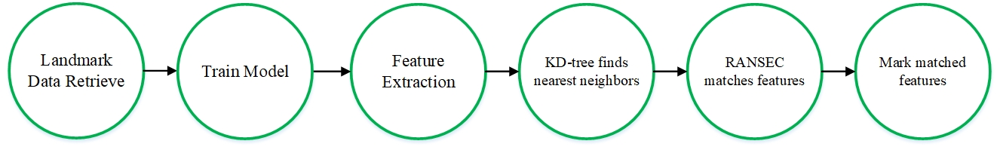
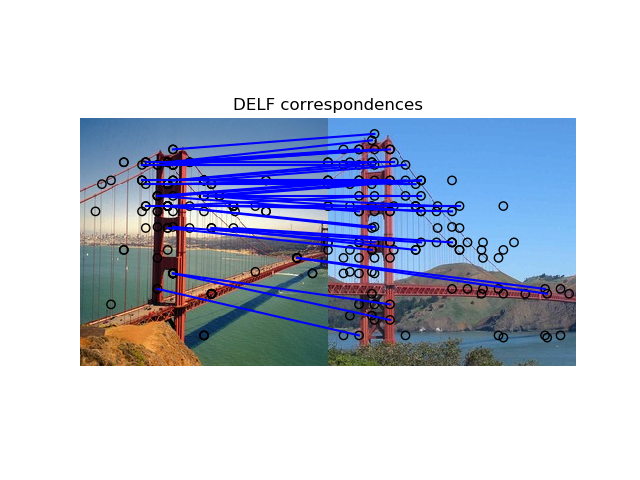

# CloudMark
## Flow Chart

## Load Image Data From Raw Dataset
Command Format: `python image_loader.py <data_file.csv> <output_dir/>`
```
python image_loader.py test.csv testImage
python image_loader.py train.csv tranImage
```
## Extract Feature
On google Colaboratory with Spark:

[](https://colab.research.google.com/drive/1v5helOZeBYOzpiIkJJ7wM6eoD34VwP29)

Or view local version in:
[resize_image.py](https://github.com/jeness/CloudMark/blob/master/resize_image.py)
[pretrain_feature.py](https://github.com/jeness/CloudMark/blob/master/pretrain_feature.py)
[main_match.py](https://github.com/jeness/CloudMark/blob/master/main_match.py)

## Result Image


